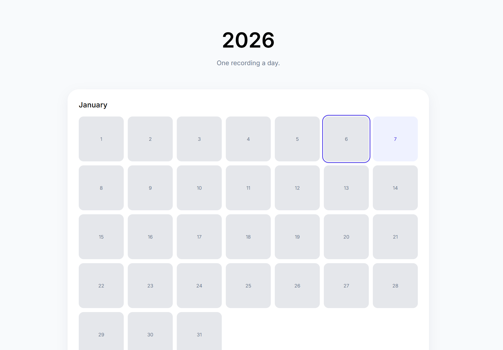

# 2026 Audio Diary

An open-source audio diary website - one recording per day.

Click any date to record or play back your daily entry.
Audio is loaded from `audio/YYYY-MM-DD.*`.
Notes are loaded from `notes/YYYY-MM-DD.txt` and saved back to that same folder.

## Run locally

Fastest option on Windows:

```powershell
.\start_diary.cmd
```

That starts the local server if needed and opens `http://127.0.0.1:8765`.

Manual option:

```powershell
python server.py
```

Then open `http://127.0.0.1:8765`.

Optional custom port:

```powershell
$env:DIARY_PORT = "9000"
python server.py
```

Open the app through the server instead of opening `index.html` directly, because note saves go through the local `/api/notes/:date` endpoint.


